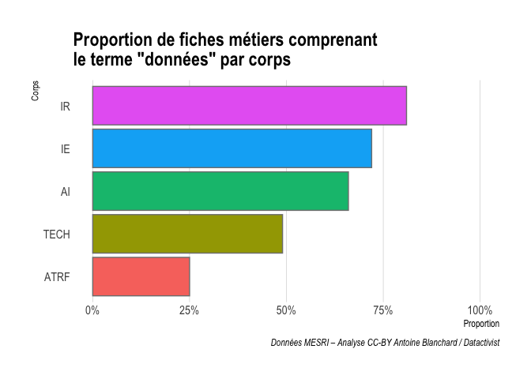
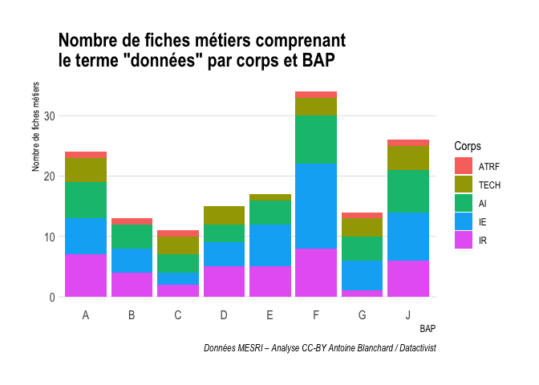

Analyse des données RéFérens III
================
Antoine Blanchard
02/03/2021

-   [Import du référentiel métier
    RéFérens](#import-du-référentiel-métier-référens)
-   [Transformation des données](#transformation-des-données)
-   [Analyse des données](#analyse-des-données)
    -   [Distribution des fiches
        métiers](#distribution-des-fiches-métiers)
    -   [Occurrences de l’expression “données” par
        champ](#occurrences-de-lexpression-données-par-champ)
    -   [Liste des 11 métiers dont l’intitulé contient l’expression
        “données”](#liste-des-11-métiers-dont-lintitulé-contient-lexpression-données)
    -   [Occurrences de l’expression “données” par
        BAP](#occurrences-de-lexpression-données-par-bap)
    -   [Occurrences de l’expression “données” par
        corps](#occurrences-de-lexpression-données-par-corps)
    -   [Fréquence de l’expression “données” par BAP et par
        corps](#fréquence-de-lexpression-données-par-bap-et-par-corps)
    -   [Liste des métiers IE de la BAP F liés aux
        données](#liste-des-métiers-ie-de-la-bap-f-liés-aux-données)
    -   [Métiers qui concentrent le plus le terme
        “données”](#métiers-qui-concentrent-le-plus-le-terme-données)
    -   [Dispersion des fiches métiers par
        corps](#dispersion-des-fiches-métiers-par-corps)
    -   [Métiers des BAP E, F, G, J où “données” apparaît comme facteur
        d’évolution moyen
        terme](#métiers-des-bap-e-f-g-j-où-données-apparaît-comme-facteur-dévolution-moyen-terme)
    -   [Métiers où “données” apparaît comme “intitulé précédent” et a
        disparu de l’intitulé
        actuel](#métiers-où-données-apparaît-comme-intitulé-précédent-et-a-disparu-de-lintitulé-actuel)
-   [TO DO](#to-do)
    -   [Afficher le terme “données” en kwic (keyword-in-context) et
        représenter son voisinage lexical (qualificatifs, verbes
        relatifs à des processus
        managériaux…)](#afficher-le-terme-données-en-kwic-keyword-in-context-et-représenter-son-voisinage-lexical-qualificatifs-verbes-relatifs-à-des-processus-managériaux)
    -   [Répéter les étapes avec le terme
        “archives”](#répéter-les-étapes-avec-le-terme-archives)

## Import du référentiel métier RéFérens

RéFérens (REFérentiel des Emplois-types de la recherche et de
l’Enseignement Supérieur) version III est [fourni par le Ministère de
l’enseignement supérieur, de la recherche et de
l’innovation](https://www.data.gouv.fr/fr/datasets/referentiel-metiers-referens-iii-pour-la-filiere-des-itrf-1/),
sur leur portail open data. On l’importe :

``` r
data <- read.csv2("fr-esr_referentiel_metier_referens_3.csv") %>%
  mutate(Id = row_number())

variables <- data %>%
  select(-Id) %>%
  colnames()
```

Il comporte 242 lignes ou fiches métiers, conformément à ce qui est
annoncé sur le portail data.gouv.fr :

> Ce jeu de données reprend les informations et nomenclatures concernant
> les 242 métiers des ingénieurs et personnels techniques de recherche
> et de formation (ITRF) et des ingénieurs et personnels techniques de
> la recherche (ITA) décrits dans le répertoire des branches d’activités
> professionnelles et des emplois-types, dénommé RéFérens (REFérentiel
> des Emplois-types de la recherche et de l’Enseignement Supérieur).

## Transformation des données

On définit les chaînes de caractère qui seront comptées dans le document
comme des occurrences du terme “données” :

``` r
donnees <- "Donnees|donnees|Données|données|Donnee|donnee|Donnée|donnée"
```

On dénombre, pour chaque cellule, les occurrences du terme “données” et
on les ajoute aux données brutes pour former le tableau
**data\_filtered** :

``` r
denombrement <- data %>%
  column_to_rownames("Id") %>%
  #select(Nom des colonnes, séparées par une virgule) %>%
  mutate_all(str_count, donnees) %>%
  mutate(somme = rowSums(.)) %>%
  rownames_to_column("Id") %>%
  filter(somme > 0) %>%
  arrange(desc(somme))
  
data_filtered <- data %>%
  filter(Id %in% denombrement$Id) %>%
  mutate(Id = as.character(Id)) %>%
  left_join(denombrement %>% select(Id, somme), by = "Id") %>%
  arrange(desc(somme))
```

# Analyse des données

## Distribution des fiches métiers

On trace la distribution des 154 fiches métiers selon le nombre de fois
où apparaît le terme “données” :

``` r
# Classer les corps dans l'ordre hiérarchique
ordre_corps <- c("ATRF", "TECH", "AI", "IE", "IR")

data_filtered %>%
    mutate(referens_id = fct_reorder(referens_id, -somme),
         referens_cs=factor(referens_cs, levels = ordre_corps)) %>%
  ggplot(aes(x = referens_id, y = somme, color=referens_cs)) +
  geom_point() +
  labs(x="Rang", y="Nombre d'occurrences du terme ''données''", color="Corps",
       title="Distribution des fiches métiers",
       caption="Données MESRI – Visualisation CC-BY Antoine Blanchard / Datactivist") +
  theme_ipsum() +
  theme(axis.title.x=element_blank(),
        axis.text.x=element_blank(),
        axis.ticks.x=element_blank())
```

<!-- -->

On observe une distribution fortement asymétrique.

## Occurrences de l’expression “données” par champ

Dans quelles colonnes du jeu de données (variable) trouve-t-on le plus
le terme “données” ?

``` r
denombrement %>%
  select(-somme) %>%
  column_to_rownames("Id") %>%
  summarise_all(sum) %>%
  rownames_to_column("Id") %>%
  gather("variable", "somme", -Id) %>%
  filter(somme > 0) %>%
  ggplot(aes(x=fct_reorder(variable, somme), y = somme)) +
  geom_col(aes(fill = variable), color = "grey50") +
  labs(x = "", y = "Nombre d'occurrences du terme ''données''",
       caption="Données MESRI – Visualisation CC-BY Antoine Blanchard / Datactivist")+
  coord_flip()+
  theme_ipsum() +
  theme(legend.position = "none")
```

<!-- -->

Comme on pouvait s’y attendre, le terme données apparaît le plus dans
les champs qui décrivent les compétences opérationnelles (rang 1) et les
activités principales (rang 2) des fiches métiers. Il apparaît assez peu
dans l’intitulé des fiches métiers (voir ci-après), qui est au 9e rang,
précédé du champ “intitulé précédent” qui mérite d’être creusé pour
comprendre pourquoi certaines occurrences ont disparu (voir plus loin).
Au 6e rang, donc assez haut, on trouve le champ “Facteurs d’évolution à
moyen terme” du métier qui vise, selon la documentation de RéFérens, à
identifier les facteurs clés et en déduire leur impact qualitatif sur le
métier.

## Liste des 11 métiers dont l’intitulé contient l’expression “données”

``` r
intitule_TRUE <- denombrement %>%
  filter(denombrement$referens_intitule >0 | denombrement$referens_metiers >0)

intitule_filtered <- data_filtered %>%
  filter(Id %in% intitule_TRUE$Id) %>%
  mutate(Id = as.character(Id),
         referens_cs=factor(referens_cs, levels = ordre_corps)) %>%
  left_join(data_filtered %>% select(Id, somme), by = "Id") %>%
  select(referens_intitule, referens_metiers, bap, referens_fap, referens_cs) %>%
  group_by(bap) %>%
  arrange(referens_cs, .by_group = TRUE)

kable(intitule_filtered, caption = "Métiers incluant le terme 'données' dans leur intitulé")
```

| referens\_intitule                                                             | referens\_metiers                        | bap                                                                   | referens\_fap                                                                     | referens\_cs |
|:-------------------------------------------------------------------------------|:-----------------------------------------|:----------------------------------------------------------------------|:----------------------------------------------------------------------------------|:-------------|
| Assistant-e ingénieur-e biologiste en traitement de données                    |                                          | BAP A - Sciences du vivant, de la terre et de l’environnement         | Biologie et santé, Sciences de la vie et de la terre                              | AI           |
| Ingénieur-e biologiste en traitement de données                                | epidémiologiste\|bio informaticien       | BAP A - Sciences du vivant, de la terre et de l’environnement         | Biologie et santé, Sciences de la vie et de la terre                              | IE           |
| Ingénieur-e biologiste en analyse de données                                   | epidémiologiste\|bio informaticien       | BAP A - Sciences du vivant, de la terre et de l’environnement         | Biologie et santé, Sciences de la vie et de la terre                              | IR           |
| Technicien-ne en production, traitement de données et enquêtes                 |                                          | BAP D - Sciences Humaines et Sociales                                 | Production, traitement et analyse des données                                     | TECH         |
| Assistant-e ingénieur-e en production, traitement de données et enquêtes       |                                          | BAP D - Sciences Humaines et Sociales                                 | Production, traitement et analyse des données                                     | AI           |
| Ingénieur-e d’études en production, traitement, analyse de données et enquêtes |                                          | BAP D - Sciences Humaines et Sociales                                 | Production, traitement et analyse des données                                     | IE           |
| Ingénieur-e de recherche en production, traitement et analyse de données       |                                          | BAP D - Sciences Humaines et Sociales                                 | Production, traitement et analyse des données                                     | IR           |
| Administrateur-trice de bases de données / Intégrateur d’applications          | administrateur de bases de données (dba) | BAP E - Informatique, Statistiques et Calcul scientifique             | Ingénierie technique et de production                                             | IE           |
| Chargé-e de l’édition de corpus numériques                                     | éditeur de données scientifiques         | BAP F - Culture, Communication, Production et diffusion des savoirs   | Édition et graphisme                                                              | IE           |
| Chargé-e du traitement des données scientifiques                               |                                          | BAP F - Culture, Communication, Production et diffusion des savoirs   | Information scientifique et technique, documentation et collections patrimoniales | IE           |
| Gestionnaire de données et indicateurs patrimoniaux                            |                                          | BAP G - Patrimoine immobilier, Logistique, Restauration et Prévention | Patrimoine immobilier                                                             | AI           |

Métiers incluant le terme ‘données’ dans leur intitulé

## Occurrences de l’expression “données” par BAP

Proportion des fiches métiers qui contiennent l’expression “données” par
BAP :

``` r
BAP_filtered <- data_filtered %>%
  count(bap) %>%
  arrange(bap)

BAP <- data %>%
  count(bap)

BAP_filtered_pourcentage <- BAP_filtered %>%
  left_join(BAP, BAP_filtered, by = "bap") %>%
  mutate(pourcentage_bap=round(n.x/n.y,2),
         bap=fct_reorder(bap, bap, .desc = TRUE))

BAP_filtered_pourcentage %>%
  ggplot(aes(x = bap, y = pourcentage_bap)) +
  geom_col(aes(fill = bap), color = "grey50") +
  labs(x = "", y = "Proportion",
       title="Proportion de fiches métiers liées aux ''données'' par BAP",
    caption="Données MESRI – Visualisation CC-BY Antoine Blanchard / Datactivist") +
  theme_ipsum() +
  coord_flip() +
  theme_ipsum(grid="X") +
  theme(legend.position = "none") +
  scale_fill_manual(values = brewer.pal(8, "YlOrRd")) +
  scale_y_continuous(labels = scales::percent, limits = c(0,1))
```

<!-- -->

On constate que les BAP E et D possèdent en proportion la plus grande
part de métiers liés aux données : c’est intéressant de voir le soutien
à la recherche en SHS si haut. Les BAP A, B et C, qui concernent
directement le soutien à la recherche, sont moins concernés par les
données que les BAP F et J qui sont liés à l’administration de
l’université et se retrouvent plutôt dans l’administration centrale.

## Occurrences de l’expression “données” par corps

Proportion des fiches métiers qui contiennent l’expression “données” par
corps :

``` r
corps_filtered <- data_filtered %>%
  count(referens_cs) %>%
  arrange(desc(n))

corps <- data %>%
  count(referens_cs)

corps_filtered_pourcentage <- corps_filtered %>%
  left_join(corps, corps_filtered, by = "referens_cs") %>%
  mutate(pourcentage_corps=round(n.x/n.y,2),
         referens_cs=factor(referens_cs, levels = ordre_corps))

corps_filtered_pourcentage %>%
  ggplot(aes(x = referens_cs, y = pourcentage_corps)) +
  geom_col(aes(fill = referens_cs), color = "grey50") +
  labs(x = "Corps", y = "Proportion",
       title="Proportion de fiches métiers liées aux ''données'' par corps",
      caption="Données MESRI – Visualisation CC-BY Antoine Blanchard / Datactivist") +
  coord_flip() +
  theme_ipsum(grid="X") +
  theme(legend.position = "none") +
  scale_y_continuous(labels = scales::percent, limits = c(0,1))
```

<!-- -->

On constate que la proportion de métiers liés aux données varie en même
temps que l’ordre hiérarchique : elle est plus grande pour les corps
ayant le plus de missions d’encadrement.

## Fréquence de l’expression “données” par BAP et par corps

``` r
data_filtered %>%
      mutate(referens_cs=factor(referens_cs, levels = ordre_corps)) %>%
  ggplot(aes(x = referens_bap_id, fill=referens_cs)) +
    geom_bar() +
      labs(x= "BAP", y = "Nombre de fiches métiers", fill="Corps",
           title="Nombre de fiches métiers liées aux données par corps et par BAP",
         caption="Données MESRI – Visualisation CC-BY Antoine Blanchard / Datactivist") +
theme_ipsum(grid="Y")
```

<!-- -->

En valeur absolue, la BAP F Culture, Communication, Production et
diffusion des savoirs concentre le plus grand nombre de fiches métiers
liées aux données, grâce à un nombre très important de métiers
appartenant au corps des IE.

Nous voulons savoir quels sont ces métiers IE de la BAP F.

## Liste des métiers IE de la BAP F liés aux données

``` r
temp <- data_filtered %>%
  filter(referens_cs %in% c("IE") & referens_bap_id %in% c("F")) %>%
  select (referens_intitule, bap, referens_fap, referens_cs, somme)

  kable(temp, caption="Métiers IE de la BAP F liés aux données") 
```

| referens\_intitule                                                  | bap                                                                 | referens\_fap                                                                     | referens\_cs | somme |
|:--------------------------------------------------------------------|:--------------------------------------------------------------------|:----------------------------------------------------------------------------------|:-------------|------:|
| Chargé-e de l’édition de corpus numériques                          | BAP F - Culture, Communication, Production et diffusion des savoirs | Édition et graphisme                                                              | IE           |    11 |
| Chargé-e des systèmes d’information documentaire                    | BAP F - Culture, Communication, Production et diffusion des savoirs | Information scientifique et technique, documentation et collections patrimoniales | IE           |    10 |
| Chargé-e d’archives                                                 | BAP F - Culture, Communication, Production et diffusion des savoirs | Information scientifique et technique, documentation et collections patrimoniales | IE           |     9 |
| Chargé-e du traitement des données scientifiques                    | BAP F - Culture, Communication, Production et diffusion des savoirs | Information scientifique et technique, documentation et collections patrimoniales | IE           |     9 |
| Chargé-e de collections muséales                                    | BAP F - Culture, Communication, Production et diffusion des savoirs | Information scientifique et technique, documentation et collections patrimoniales | IE           |     4 |
| Chargé-e de fabrication et graphisme                                | BAP F - Culture, Communication, Production et diffusion des savoirs | Édition et graphisme                                                              | IE           |     3 |
| Traducteur-trice                                                    | BAP F - Culture, Communication, Production et diffusion des savoirs | Information scientifique et technique, documentation et collections patrimoniales | IE           |     3 |
| Chargé-e des ressources documentaires                               | BAP F - Culture, Communication, Production et diffusion des savoirs | Information scientifique et technique, documentation et collections patrimoniales | IE           |     3 |
| Ingénieur-e pour l’enseignement numérique                           | BAP F - Culture, Communication, Production et diffusion des savoirs | Productions audiovisuelles, productions pédagogiques et web                       | IE           |     2 |
| Ingénieur-e en technologies de l’information et de la communication | BAP F - Culture, Communication, Production et diffusion des savoirs | Productions audiovisuelles, productions pédagogiques et web                       | IE           |     1 |
| Animateur-trice de communautés                                      | BAP F - Culture, Communication, Production et diffusion des savoirs | Médiation scientifique, culture et communication                                  | IE           |     1 |
| Chargé-e de communication                                           | BAP F - Culture, Communication, Production et diffusion des savoirs | Médiation scientifique, culture et communication                                  | IE           |     1 |
| Chargé-e de médiation scientifique                                  | BAP F - Culture, Communication, Production et diffusion des savoirs | Médiation scientifique, culture et communication                                  | IE           |     1 |
| Chargé-e de projets culturels                                       | BAP F - Culture, Communication, Production et diffusion des savoirs | Médiation scientifique, culture et communication                                  | IE           |     1 |

Métiers IE de la BAP F liés aux données

## Métiers qui concentrent le plus le terme “données”

On classe les métiers qui concentrent le plus le terme “données” et on
affiche ceux où le terme apparaît 15 fois ou plus :

``` r
top_metiers <- data_filtered %>%
  filter(somme >= 15) %>%
  arrange(desc(somme)) %>%
  select (referens_intitule, bap, referens_fap, referens_cs, somme)

kable(top_metiers, caption = "Métiers incluant au moins 15 fois le terme 'données'")
```

| referens\_intitule                                                             | bap                                                           | referens\_fap                                        | referens\_cs | somme |
|:-------------------------------------------------------------------------------|:--------------------------------------------------------------|:-----------------------------------------------------|:-------------|------:|
| Ingénieur-e de recherche en production, traitement et analyse de données       | BAP D - Sciences Humaines et Sociales                         | Production, traitement et analyse des données        | IR           |    35 |
| Ingénieur-e d’études en production, traitement, analyse de données et enquêtes | BAP D - Sciences Humaines et Sociales                         | Production, traitement et analyse des données        | IE           |    29 |
| Technicien-ne en production, traitement de données et enquêtes                 | BAP D - Sciences Humaines et Sociales                         | Production, traitement et analyse des données        | TECH         |    25 |
| Assistant-e ingénieur-e en production, traitement de données et enquêtes       | BAP D - Sciences Humaines et Sociales                         | Production, traitement et analyse des données        | AI           |    24 |
| Assistant-e ingénieur-e biologiste en traitement de données                    | BAP A - Sciences du vivant, de la terre et de l’environnement | Biologie et santé, Sciences de la vie et de la terre | AI           |    23 |
| Assistant-e statisticien-ne                                                    | BAP E - Informatique, Statistiques et Calcul scientifique     | Statistiques                                         | AI           |    21 |
| Administrateur-trice de bases de données / Intégrateur d’applications          | BAP E - Informatique, Statistiques et Calcul scientifique     | Ingénierie technique et de production                | IE           |    20 |
| Ingénieur-e statisticien-ne                                                    | BAP E - Informatique, Statistiques et Calcul scientifique     | Statistiques                                         | IE           |    17 |
| Ingénieur-e d’études en sciences de l’information géographique                 | BAP D - Sciences Humaines et Sociales                         | Sciences de l’information géographique               | IE           |    15 |

Métiers incluant au moins 15 fois le terme ‘données’

On constate que ce sont beaucoup de métiers AI, beaucoup en soutien à la
recherche. Question : on a vu que les corps IE et IR possèdent
proportionnellement plus de métiers liés **aux** données, mais dans
quels corps trouve-t-on les métiers **des** données (c’est-à-dire où le
terme apparaît le plus fréquemment) ?

## Dispersion des fiches métiers par corps

On trace la dispersion des fiches métiers par corps selon les
occurrences du mot “données”, avec une représentation par boxplot :

``` r
data_filtered %>%
      mutate(referens_cs=factor(referens_cs, levels = ordre_corps)) %>%
  ggplot(aes(x = referens_cs, y = somme, color=referens_cs)) +
    geom_boxplot()+
  geom_jitter(shape=16, position=position_jitter (0.2)) +
    labs(x= "Corps", y = "Nombre d'occurrences du terme ''données''", color="Corps",
         title="Dispersion des fiches métiers liées aux données par corps",
         caption="Données MESRI – Visualisation CC-BY Antoine Blanchard / Datactivist") +
  theme_ipsum() +
    theme(legend.position = "none")
```

<!-- -->

Il apparaît que les corps IE et IR ont la distribution la plus étirée
vers le haut, ce sont ceux où l’on trouve le plus de métiers **des**
données.

## Métiers des BAP E, F, G, J où “données” apparaît comme facteur d’évolution moyen terme

``` r
evolution_metiers <- data_filtered %>%
  mutate(Id = as.character(Id)) %>%
  left_join(denombrement %>% select(Id, referens_facteurs_d_evolution_moyen_terme), by = "Id") %>%
  filter(referens_facteurs_d_evolution_moyen_terme.y >0) %>%
  filter(referens_bap_id %in% c("E", "F", "G", "J")) %>%
  group_by(bap) %>%
  arrange(referens_cs, .by_group = TRUE)

evolution_metiers_extrait <- evolution_metiers %>%
  select (referens_intitule, bap, referens_fap, referens_cs, somme)

  kable(evolution_metiers_extrait, caption = "Métiers où 'données' apparaît comme facteur d'évolution moyen terme") 
```

| referens\_intitule                                         | bap                                                                   | referens\_fap                                                                     | referens\_cs | somme |
|:-----------------------------------------------------------|:----------------------------------------------------------------------|:----------------------------------------------------------------------------------|:-------------|------:|
| Assistant-e statisticien-ne                                | BAP E - Informatique, Statistiques et Calcul scientifique             | Statistiques                                                                      | AI           |    21 |
| Ingénieur-e statisticien-ne                                | BAP E - Informatique, Statistiques et Calcul scientifique             | Statistiques                                                                      | IE           |    17 |
| Ingénieur-e en calcul scientifique                         | BAP E - Informatique, Statistiques et Calcul scientifique             | Calcul scientifique                                                               | IE           |     4 |
| Administrateur-trice systèmes et réseaux                   | BAP E - Informatique, Statistiques et Calcul scientifique             | Ingénierie technique et de production                                             | IE           |     1 |
| Expert-e en information statistique                        | BAP E - Informatique, Statistiques et Calcul scientifique             | Statistiques                                                                      | IR           |    10 |
| Expert-e en calcul scientifique                            | BAP E - Informatique, Statistiques et Calcul scientifique             | Calcul scientifique                                                               | IR           |     2 |
| Assistant-e d’édition                                      | BAP F - Culture, Communication, Production et diffusion des savoirs   | Édition et graphisme                                                              | AI           |     2 |
| Chargé-e de l’édition de corpus numériques                 | BAP F - Culture, Communication, Production et diffusion des savoirs   | Édition et graphisme                                                              | IE           |    11 |
| Chargé-e d’archives                                        | BAP F - Culture, Communication, Production et diffusion des savoirs   | Information scientifique et technique, documentation et collections patrimoniales | IE           |     9 |
| Chargé-e du traitement des données scientifiques           | BAP F - Culture, Communication, Production et diffusion des savoirs   | Information scientifique et technique, documentation et collections patrimoniales | IE           |     9 |
| Responsable éditorial-e                                    | BAP F - Culture, Communication, Production et diffusion des savoirs   | Édition et graphisme                                                              | IR           |     6 |
| Dessinateur-trice gestionnaire et indicateurs patrimoniaux | BAP G - Patrimoine immobilier, Logistique, Restauration et Prévention | Patrimoine immobilier                                                             | TECH         |     4 |

Métiers où ‘données’ apparaît comme facteur d’évolution moyen terme

Dans ces BAP liés à l’administration centrale, on remarque l’absence de
la BAP J et la quasi-absence de la BAP G, dont aucun métier ne prend la
donnée en compte pour leur évolution moyen terme. Pourtant, les
entretiens que nous avons menés montrent que ces domaines de la gestion
du patrimoine immobilier et du pilotage sont fortement amenés à évoluer
dans le contexte de la donnée.

## Métiers où “données” apparaît comme “intitulé précédent” et a disparu de l’intitulé actuel

``` r
suppression_metiers <- denombrement %>%
  filter(referens_intitule_precedent >0 & referens_intitule ==0) %>%
  mutate(Id = as.character(Id)) %>% 
  select(Id) %>%
  left_join(data_filtered, by = "Id") %>%
  select (referens_intitule, referens_intitule_precedent, bap, referens_fap, referens_cs) %>%
  arrange(referens_cs) # Bug car ne s'ordonne pas par corps

kable(suppression_metiers, caption = "Métiers dont l'ancien intitulé incluait le terme 'données' contrairement à l'intitulé actuel")
```

| referens\_intitule                                                           | referens\_intitule\_precedent                                          | bap                                                       | referens\_fap                                                                | referens\_cs |
|:-----------------------------------------------------------------------------|:-----------------------------------------------------------------------|:----------------------------------------------------------|:-----------------------------------------------------------------------------|:-------------|
| Gestionnaire d’application / assistance support                              | Gestionnaire de base de données                                        | BAP E - Informatique, Statistiques et Calcul scientifique | Ingénierie des systèmes d’information                                        | AI           |
| Technicien-ne d’exploitation, d’assistance et de traitement de l’information | Technicien d’exploitation, de maintenance et de traitement des données | BAP E - Informatique, Statistiques et Calcul scientifique | Ingénierie des systèmes d’information\|Ingénierie technique et de production | TECH         |

Métiers dont l’ancien intitulé incluait le terme ‘données’ contrairement
à l’intitulé actuel

Dans le premier cas il s’agit d’une évolution des missions, dans le
second cas de la substitution du terme “données” par “information”. Il
faudrait voir dans quelle mesure cette substitution est significative ou
non.

# TO DO

## Afficher le terme “données” en kwic (keyword-in-context) et représenter son voisinage lexical (qualificatifs, verbes relatifs à des processus managériaux…)

## Répéter les étapes avec le terme “archives”
